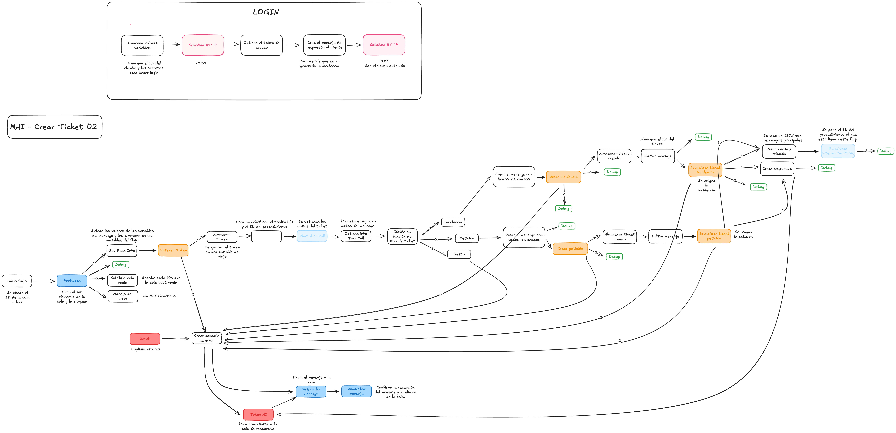

# Flujo Node-RED: MHI Crear Ticket 02

Este es un flujo cuyo objetivo es la **creación y gestión de tickets**. A continuación, se explica la lógica principal de cada sección del flujo.

## Paso a Paso del Flujo

1. **Sacar primer elemento de la cola**: Se bloquea la cola y se saca el primer elemento. Si la cola está vacía, cada 10s se escribe que la cola está vacía.
2. **Extraer valores del primer elemento de la cola**: Se extraen los valores del primer elemento de la cola y se almacenan en variables del flujo.
3. **Obtener y almacenar token**
4. **Obtener datos del ticket**: Se obtienen los datos del ticket haciendo una llamada a la API del Chat.
5. En función del **tipo de ticket**:

	- <u> **INCIDENCIA**:</u>

		1. Se crea el mensaje para crear posteriormente la incidencia.
		2. Se crea la incidencia.
		3. Se almacena el ticket creado.
		4. Se actualiza el ticket para asignárselo a alguien.
		5. Se crea el mensaje de respuesta y se envía a la cola.
		6. Se hace la unión entre el flujo y el procedimiento.

	- <u> **PETICIÓN**:</u>

		1. Se crea el mensaje para crear posteriormente la petición.
		2. Se crea la petición.
		3. Se almacena el ticket creado.
		4. Se actualiza el ticket para asignárselo a alguien.
		5. Se crea el mensaje de respuesta y se envía a la cola.
		6. Se hace la unión entre el flujo y el procedimiento.

Cuando algún proceso da **error**:

1. Crear el **mensaje de error**.
2. Conectarse a la **cola de respuesta**.
3. Responder con el **mensaje de error**.
4. Comprobar que **el mensaje se ha recibido y eliminarlo de la cola**.

Por último, en el proceso de **Login**:

1. Se obtienen los datos del ID del cliente y los secretos correspondientes.
2. Se hace una solicitud HTTP para **conseguir el token**.
3. Se crea el **mensaje de respuesta** hacia el usuario y se envía.
