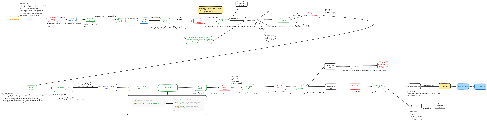

# Flujo Node-RED: MHI Reclamacion con plantilla 28

Este es un flujo cuyo objetivo es la **reclamacion de ticket con plantilla**. A continuación, se explica la lógica principal de cada sección del flujo.

## Requisitos
Añadir comentario en el ticket reclamado con el comentario de reclamacion
Crear una WO en Click On (De reclamacion)

## Paso a Paso del Flujo

1. **Sacar primer elemento de la cola**: Se bloquea la cola y se saca el primer elemento. Si la cola está vacía, cada 10s se escribe que la cola está vacía.
2. Se obtiene el **token de Remedy** y se almacena.
3. Se obtiene el **token de Azure** con Graph y se almacena.
4. Se obtiene el **upn y displayName** con Graph.
5. **Login en Remedy** y hacer una consulta de la persona. Si la persona que solicita la reclamacion no es la misma que la asociada al ticket a reclamar, se avisa del error.
6. Si se encuentra la persona y no es ni una petición, cambio o incidencia, buscar el ticket.
7. Si se encuentra el ticket, en función del **tipo de ticket**:

	- <u> **INCIDENCIA**:</u>

		1. Se obtienen el ticket de click on de la incidencia a reclamar, submitter y Customer Login ID.
		2. Si la salida es completa, se guarda el ticket de click on.
		3. El siguiente paso puede ser uno de estos dos:

	- <u> **PETICIÓN**:</u>

		1. Se obtienen el ticket de click on de la peticion a reclamar, submitter y Customer Login ID.
		2. Si la salida es completa, se guarda el ticket de click on
		3. El siguiente paso puede ser uno de estos dos:

	- <u> **CAMBIO**:</u>

		1. Se obtienen el ticket de click on del cambio a reclamar, submitter y Customer Login ID.
		2. Si la salida es completa, se guarda el ticket de click on
		3. El siguiente paso puede ser uno de estos dos:

8. Se recogen los datos seleccionados del procedimiento asociado, como categoria de producto, categoria operacional y titulo. Llamando a Chat API.
9. Se consulta los datos como FirstName, LastName, Site, PhoneNumber e Internet E-mail asociados al usuario de la reclamacion.
10. Se consulta el CI asociado a ese ticket y a ese usario de la reclamacion.
11. Se obtiene el tipo de ticket y se añade comentario en remedy indicando que se ha realizado una reclamacion sobre el viejo ticket sobre el que se reclama.
12. Con los datos del punto 9 se abre una WO de reclamacion en Click On.
13. Se obtienen los datos de la WO abierta en Click On
14. Se realiza la relacion entre la tool id, id de procesamiento y el id del ticket generado.
15. Se responde por la cola de entrada, que es la misma por la el usuario hablo.

Cuando algún proceso da **error**:

1. Crear el **mensaje de error** correspondiente.
2. Conectarse a la **cola de respuesta**.
3. Responder con el **mensaje de error**.
4. Comprobar que **el mensaje se ha recibido y eliminarlo de la cola**.

Por último, en el **subflujo SRID to Ticket**: Se va buscando el ticket para ver si corresponde a una incidencia, petición o cambio.
