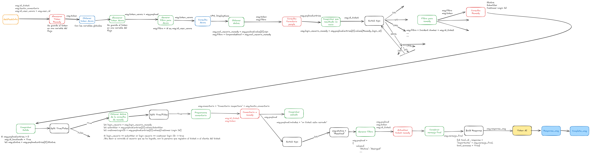

# Flujo Node-RED: MHI Reabrir Ticket 35

Este es un flujo cuyo objetivo es la **reapertura de tickets**. A continuación, se explica la lógica principal de cada sección del flujo.

## Paso a Paso del Flujo
Requisitos:
Reabrir el ticket indicado por el usuario y añadir un motivo de reapertura. Un usuario solo puede pedir la reapertura de sus tickets asociados a su usuario.

1. **Sacar primer elemento de la cola**: Se bloquea la cola y se saca el primer elemento. Si la cola está vacía, cada 10s se escribe que la cola está vacía.
2. **Extraer valores del primer elemento de la cola**: Se extraen los valores del primer elemento de la cola y se almacenan en variables del flujo. Como el id_ticket, azure_user_id, procedimiento asociado y motivo de la reclamacion.
3. Se obtiene el **token de Remedy** y se almacena.
4. Se obtiene el **token de Azure** con Graph y se almacena.
5. Se obtiene el **upn y displayName** con Graph a traves del azure_user_id (es lo que hemos obtenido del punto 2).
6. Se consulta en el formulario de people de remedy filtrando con el upn obtenido en el punto 4 (Se comprueba que la persona que esta pidiendo la reapertura pertenece a Melia), el login_usario_remedy
7. Si la persona que esta pidiendo la reapertura si que pertenece a melia, pasamos al punto 7
8. En función del **tipo de ticket**:

	- <u> **INCIDENCIA**:</u>

		1. Se consulta en Remedy con el numero de ticket, el status, submitter y customer_login_id.
		2. Si hay datos: se pone localizado a true y se guarda el valor del status.
		3. Se guarda el customer_login_id, submitter y login_usuario_remedy. Si el login_usuario_remedy coincide con el submitter o con el customer_login_id, continua. Es decir si el usuario que ha escrito por teams que quiere reabrir el ticket coincide con la persona afectada del ticket o con el que abrio el ticket, continua.

	- <u> **PETICIÓN**:</u>

		1. Se consulta en Remedy con el numero de ticket, el status, submitter y customer_login_id.
		2. Si hay datos: se pone localizado a true y se guarda el valor del status.
		3. Se guarda el customer_login_id, submitter y login_usuario_remedy. Si el login_usuario_remedy coincide con el submitter o con el customer_login_id, continua. Es decir si el usuario que ha escrito por teams que quiere reabrir el ticket coincide con la persona afectada del ticket o con el que abrio el ticket, continua.

	- <u> **CAMBIO**:</u>

		1. Se consulta en Remedy con el numero de ticket, el status, submitter y customer_login_id.
		2. Si hay datos: se pone localizado a true y se guarda el valor del status.
		3. Se guarda el customer_login_id, submitter y login_usuario_remedy. Si el login_usuario_remedy coincide con el submitter o con el customer_login_id, continua. Es decir si el usuario que ha escrito por teams que quiere reabrir el ticket coincide con la persona afectada del ticket o con el que abrio el ticket, continua.

9. Si el usuario no ha añadido comentario de reapertura al escribir por teams, se crea uno por defecto sino, el comentario de reapertura será el que ha escrito el usuario por el chat
10. Llamada a remedy para añadir el comentario en el ticket
11. Si la llamada no sale exitosa (salta una excepcion), sera porque el ticket esta cerrado o cancelado, en ese caso se avisa con mensaje de error por teams.
12. Si la llamada sale exitosa, se comprueba que el estado del ticket no sea resuelto.
13. Si el estado es resuelto, se hace llamada Remedy para pasarlo a estado asignado.
14. Si el estado no es resuelto completamos mensaje para indicar por Teams al usuario que su incidencia o peticion ha sido reabierta.
15. Se responde por la cola de entrada, que es la misma por la el usuario hablo.

Cuando algún proceso da **error**:

1. Crear el **mensaje de error**.
2. Conectarse a la **cola de respuesta**.
3. Responder con el **mensaje de error**.
4. Comprobar que **el mensaje se ha recibido y eliminarlo de la cola**.

Por último, en el proceso de **Login**:

1. Se obtienen los datos del ID del cliente y los secretos correspondientes.
2. Se hace una solicitud HTTP para **conseguir el token**.
3. Se crea el **mensaje de respuesta** hacia el usuario y se envía.
