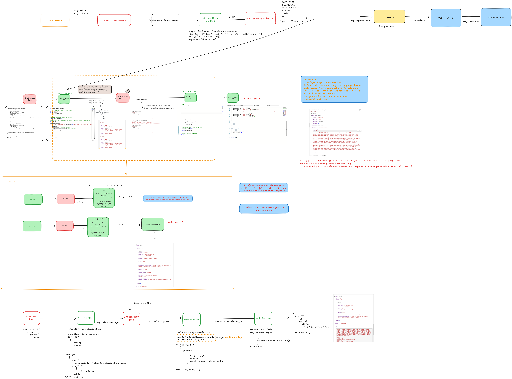

# Flujo Node-RED: MHI Consultar Incidencias Criticas 36

Este es un flujo cuyo objetivo es la **consultar incidencias criticas**. A continuación, se explica la lógica principal de cada sección del flujo.

## Paso a Paso del Flujo
Requisitos:
Consultar todas las incidencias criticas de prioridad 0 o 1 y cuyas plantillas correspondan a unas plantillas concretas de una lista.

1. **Sacar primer elemento de la cola**: Se bloquea la cola y se saca el primer elemento. Si la cola está vacía, cada 10s se escribe que la cola está vacía.
2. **Extraer valores del primer elemento de la cola**: Se extraen los valores del primer elemento de la cola y se almacenan en variables del flujo. Como el tool_user y el tool_id.
3. Se obtiene el **token de Remedy** y se almacena.
4. Se crea filtro para la busqueda de Incidencias en Remedy. Tienen que tener un status menos 4 (incidencias no cerradas ni resueltas), no ser vip y la prioridad entre 0 y 1 (criticas o altas), ademas deben pertenecer a unas plantillas concretas.
5. Se obtiene el **DWP_SRID, submit date, incident number, priority etc** con Remedy usando el filtro construido en el punto 4. Escoge las 20 primeras incidencias que le aparezcan.
6. Genera un objeto messages por cada incidencia que encuentre. El objeto messsages es un array con el user_id, valor de la incidencia y el filtro (Para buscar los comentarios de tipo público de esas incidencias).
7. Se obtiene el **detailed description** de cada incidencia.
8. Guarda los datos de cada incidencia en una variable de flujo (con una variable dinamica de pendiente), ya que tiene que comprobar cada vez que llama al nodo funcion, si ya se han obtenido los datos de las 20 incidencias para poder pasar al siguiente paso.
9. Muestra los datos de las incidencias. Por cada ticket mostrará fecha de ceación, ultimo comentario, ticket de click on, estado etc..
10. Se responde por la cola de entrada, que es la misma por la el usuario hablo y se completa el msg.

Cuando algún proceso da **error**:

1. Crear el **mensaje de error**.
2. Conectarse a la **cola de respuesta**.
3. Responder con el **mensaje de error**.
4. Comprobar que **el mensaje se ha recibido y eliminarlo de la cola**.

Por último, en el proceso de **Login**:

1. Se obtienen los datos del ID del cliente y los secretos correspondientes.
2. Se hace una solicitud HTTP para **conseguir el token**.
3. Se crea el **mensaje de respuesta** hacia el usuario y se envía.
