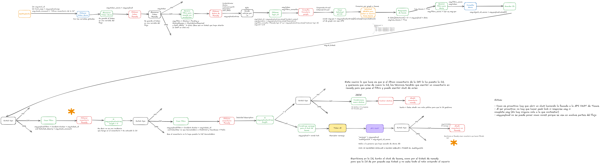

# Flujo Node-RED: MHI Gestion Proactivas

Este es un flujo cuyo objetivo es la **gestion proactivas de incidencias**. A continuación, se explica la lógica principal de cada sección del flujo.

## Requisitos
Cada hora chequear las incidencias que están pendientes, que se hayan abierto desde click on y que no tengan un comentario de que la IA haya actuado anteriormente o de que no se puede localizar al usuario al intentar poner el comentario de la IA en la iteracion anterior.
Añadir comentario en el ticket indicando que se ha avisado al usuario de que tiene una incidencia pendiente
Avisar por teams al usuario sobre su incidencia pendiente

Ojo: solo se avisará una vez en toda la vida del ticket

## Paso a Paso del Flujo

1. **Nodo de tiempo que actua cada hora**
2. Se guarda en dos variables diferentes el comentario de que la IA no ha podido localizar al usuario y el de que la IA ha enviado una nota publica al usuario. Este caso es para saber si la IA ya ha actuado antes y no repetir.
3. Se obtiene el **token de Remedy** y se almacena.
4. Se obtiene el **token de Azure** con Graph y se almacena.
5. **Login en Remedy** y se construye consulta para remedy. Se filtra por tickets con status **pending** con status reason **client action required** y que hayan sido puestos desde **click on**
6. Obtenemos los datos de remedy de esas incidencias. Incident Number, status, customer login ID.
7. Obtenemos los datos del formulario people del customer login id, como el corporate email y el internet email
8. Consultamos por graph a teams para saber si con esos mails existe una cuenta de Teams
9. Si la persona afectada en el ticket (customer login id) no tiene teams, entonces se añade un comentario en Remedy para avisar de que el usuaurio no tiene Teams, dejando la incidencia en estado pendiente
10. Si la persona afectada si que tiene teams, realizamos consulta a Azure para obtener su object ID.
11. Obtenemos el tipo de ticket que esta pendiente, para este caso en concreto siempre sera una INC, pero el flujo esta preparado para WO y CHG.
12. Si se encuentra el ticket, en función del **tipo de ticket**:

	- <u> **INCIDENCIA**:</u>

		1. Se busca en el formulario de Remedy de comentarios, si hay un comentario en la vida del ticket que coincida con las descripciones del punto 2.
		2. Si no existe un comentario con esa descripcion, se comprueba que no haya comentarios puestos por la IA o Hannah Admin y que no sean publicos

	- <u> **PETICIÓN**:</u>

		1. Se busca en el formulario de Remedy de comentarios, si hay un comentario en la vida del ticket que coincida con las descripciones del punto 2.
		2. Si no existe un comentario con esa descripcion, se comprueba que no haya comentarios puestos por la IA o Hannah Admin y que no sean publicos

	- <u> **CAMBIO**:</u>

		1. Se busca en el formulario de Remedy de comentarios, si hay un comentario en la vida del ticket que coincida con las descripciones del punto 2.
		2. Si no existe un comentario con esa descripcion, se comprueba que no haya comentarios puestos por la IA o Hannah Admin y que no sean publicos

13. En caso de que no se encuentren los comentarios del punto 12.2 Se construye mensaje para avisar por chat al usuario (A traves de una llamada HTTP a la API de CHAT, indicando a que procedimiento tiene que asociarse) y se añade el comentario en Remedy: la IA ha actuado.
14. En caso de que la llamada a la API de chat de error (no se habrá podido escribir por teams al usaurio), se escribirá un comentario en Remedy de que  no se ha podido localizar al usuario (una de las dos del punto 1)
